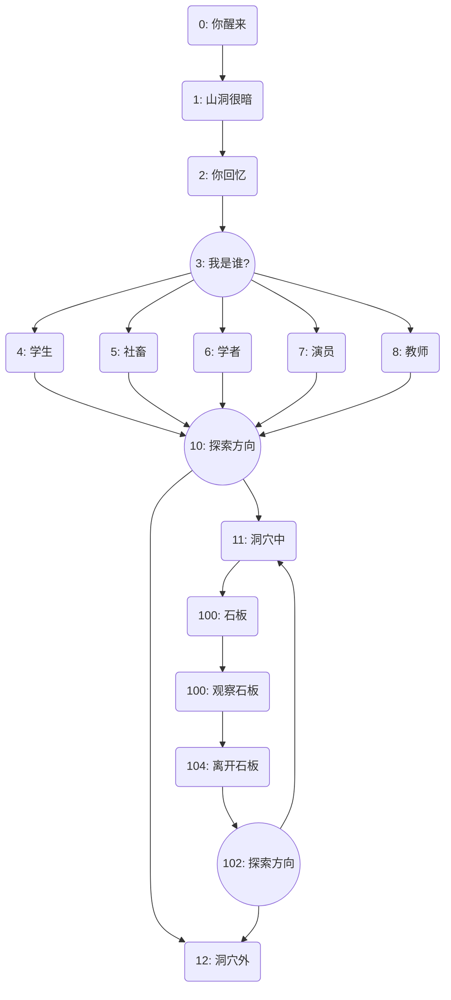

```mermaid
graph TD;
00000(0: 你醒来) --> 00001(1: 山洞很暗);
00001 --> 00002(2: 你回忆);
00002 --> 00003((3: 我是谁?));
00003 --> 00004(4: 学生);
00003 --> 00005(5: 社畜);
00003 --> 00006(6: 学者);
00003 --> 00007(7: 演员);
00003 --> 00008(8: 教师);
00004 --> 00010((10: 探索方向));
00005 --> 00010;
00006 --> 00010;
00007 --> 00010;
00008 --> 00010;
00010 --> 00011(11: 洞穴中);
00010 --> 00012(12: 洞穴外);
00011 --> 00100(100: 石板);
00100 --> 00101(100: 观察石板);
00101 --> 00104(104: 离开石板);
00102 --> 00011;
00102 --> 00012;
00104 --> 00102((102: 探索方向));
```