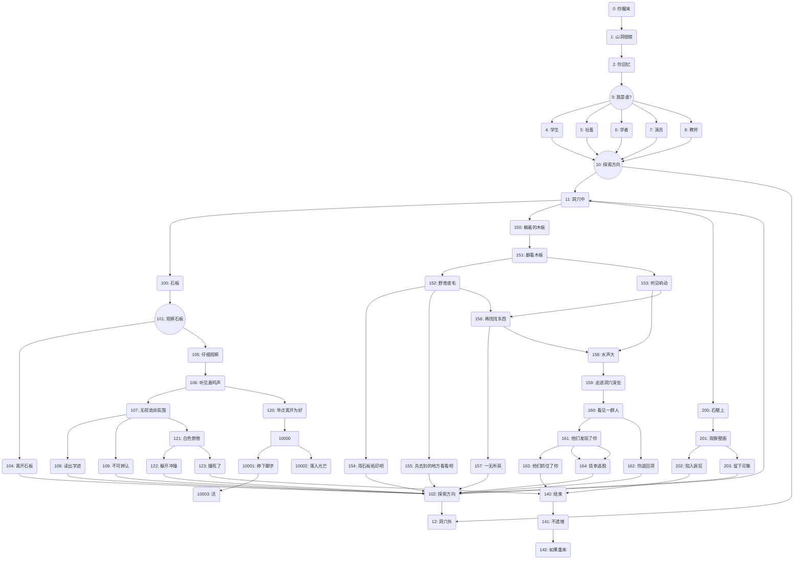

```mermaid
graph TD;
00000(0: 你醒来) --> 00001(1: 山洞很暗);
00001 --> 00002(2: 你回忆);
00002 --> 00003((3: 我是谁?));
00003 --> 00004(4: 学生);
00003 --> 00005(5: 社畜);
00003 --> 00006(6: 学者);
00003 --> 00007(7: 演员);
00003 --> 00008(8: 教师);
00004 --> 00010((10: 探索方向));
00005 --> 00010;
00006 --> 00010;
00007 --> 00010;
00008 --> 00010;
00010 --> 00011(11: 洞穴中);
00010 --> 00012(12: 洞穴外);
00011 --> 00100(100: 石板);
00011 --> 00150(150: 躺着的木板);
00011 --> 00200(200: 石壁上)
00150 --> 00151(151: 翻看木板);
00151 --> 00152(152: 野兽皮毛);
00151 --> 00153(153: 听见响动)
00152 --> 00154(154: 用石板拓印吧);
00152 --> 00155(155: 先去别的地方看看吧);
00155 --> 00102;
00152 --> 00156(156: 再找找东西);
00156 --> 00157(157: 一无所获);
00157 --> 00102;
00156 --> 00158(158: 水声大);
00158 --> 00159(159: 走进洞穴深处);
00159 --> 00160(160: 看见一群人);
00160 --> 00161(161: 他们发现了你)
00160 --> 00162(162: 你退回洞)
00162 --> 00102
00161 --> 00163(163: 他们抓住了你)
00161 --> 00164(164: 侥幸逃脱)
00164 --> 00102
00163 --> 00140
00161 --> 00164
00153 --> 00158;
00153 --> 00156;
00154 --> 00102;
00100 --> 00101((101: 观察石板));
00101 --> 00104(104: 离开石板);
00102 --> 00011;
00102 --> 00012;
00104 --> 00102(102: 探索方向);
00101 --> 00105(105: 仔细观察);
00105 --> 00106(106: 听见轰鸣声);
00106 --> 00107(107: 无视诡异氛围);
00106 --> 00120(120: 早点离开为好);
00120 --> 10000
00107 --> 00108(108: 读出字迹);
00107 --> 00109(109: 不可辨认);
00107 --> 00121(121: 白色野兽);
00121 --> 00122(122: 躲开冲撞);
00122 --> 00102;
00121 --> 00123(123: 撞死了);
00123 --> 00140(140: 结束);
00140 --> 00141(141: 不遗憾);
00141 --> 00142(142: 如果重来);
00108 --> 00102;
00109 --> 00102;
00200 --> 00201(201: 观察壁画)
00201 --> 00202(202: 陷入疯狂)
00202 --> 00140
00201 --> 00203(203: 留下印象)
00203 --> 00102
10000 --> 10001(10001: 停下脚步)
10000 --> 10002(10002: 落入光芒)
10001 --> 10003(10003: 活)
```