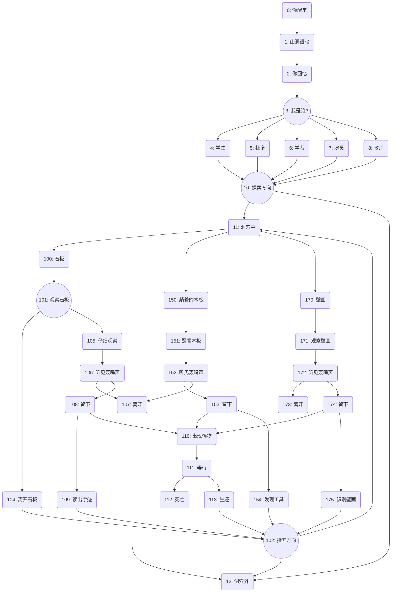

```mermaid
graph TD;
00000(0: 你醒来) --> 00001(1: 山洞很暗);
00001 --> 00002(2: 你回忆);
00002 --> 00003((3: 我是谁?));
00003 --> 00004(4: 学生);
00003 --> 00005(5: 社畜);
00003 --> 00006(6: 学者);
00003 --> 00007(7: 演员);
00003 --> 00008(8: 教师);
00004 --> 00010((10: 探索方向));
00005 --> 00010;
00006 --> 00010;
00007 --> 00010;
00008 --> 00010;
00010 --> 00011(11: 洞穴中);
00010 --> 00012(12: 洞穴外);
00011 --> 00100(100: 石板);
00011 --> 00150(150: 躺着的木板);
00150 --> 00151(151: 翻看木板);
00151 --> 00152(152: 听见轰鸣声);
00152 --> 00153(153: 留下);
00152 --> 00107;
00153 --> 00110;
00153 --> 00154(154: 发现工具);
00154 --> 00102;
00100 --> 00101((101: 观察石板));
00101 --> 00104(104: 离开石板);
00102 --> 00011;
00102 --> 00012;
00104 --> 00102((102: 探索方向));
00101 --> 00105(105: 仔细观察);
00105 --> 00106(106: 听见轰鸣声);
00106 --> 00107(107: 离开);
00107 --> 00012;
00106 --> 00108(108: 留下);
00108 --> 00109(109: 读出字迹);
00109 --> 00102;
00108 --> 00110(110: 出现怪物);
00110 --> 00111(111: 等待);
00111 --> 00112(112: 死亡);
00111 --> 00113(113: 生还);
00113 --> 00102;
00011 --> 00170(170: 壁画);
00170 --> 00171(171: 观察壁画);
00171 --> 00172(172: 听见轰鸣声);
00172 --> 00173(173: 离开);
00172 --> 00174(174: 留下);
00174 --> 00110;
00174 --> 00175(175: 识别壁画);
00175 --> 00102;
```